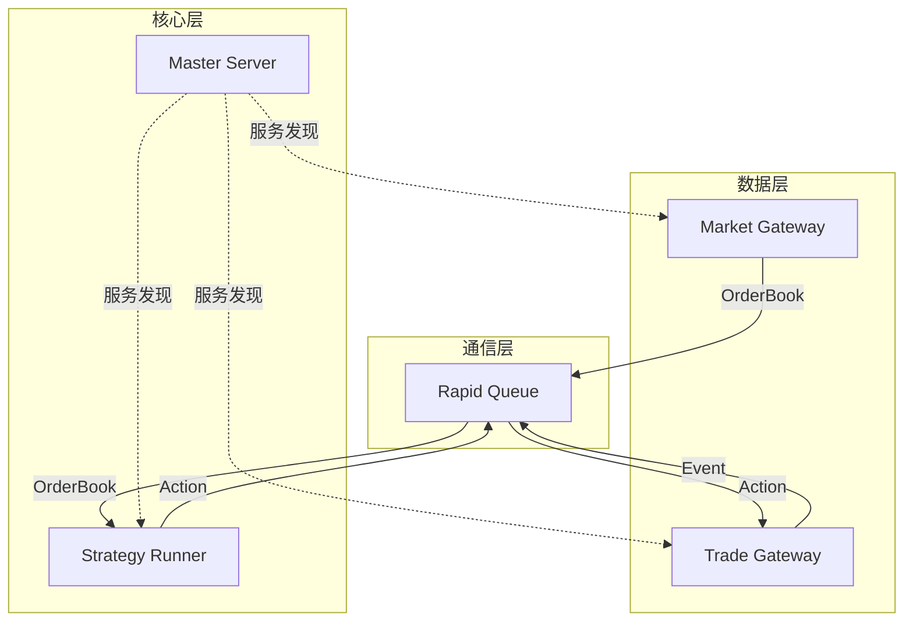

# 架构设计

本文档介绍 nnxt 的系统架构。

## 整体架构

## 核心组件

### Master Server

控制平面协调器，负责：

- Actor 注册与发现
- 队列地址管理
- 健康检查

### Strategy Runner

策略执行引擎，负责：

- 事件循环驱动
- Intent 到 Action 转换
- 订单状态管理

### Gateway

数据网关抽象：

- **Market Gateway**: 行情数据源
- **Trade Gateway**: 交易通道
