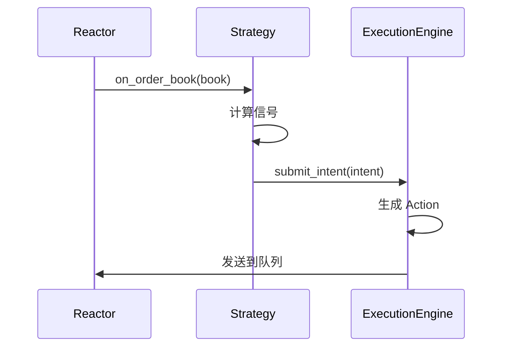

# 执行模型

本文档介绍 nnxt 的事件驱动执行流程。

## 事件循环



## 事件类型

| 事件 | 来源 | 说明 |
|------|------|------|
| `Data` | Rapid Queue | 行情/回报数据 |
| `Control` | NNG Socket | 控制命令 |
| `Timer` | 内部定时器 | 定时触发 |
| `Shutdown` | 系统信号 | 关闭信号 |

## Intent 执行流程

```python
# 1. 策略提交意图
ctx.submit_intent(Intent.target_position(...))

# 2. ExecutionEngine 转换为 Action
# 3. Action 写入队列
# 4. Trade Gateway 执行
```
