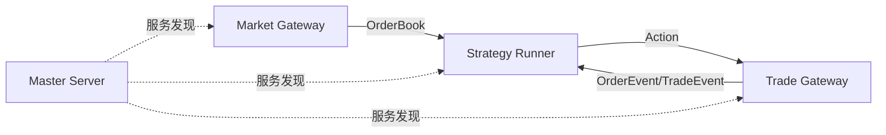

# nnxt

**高性能量化交易框架** - Python 易用性 + Rust 极致性能

---

## 核心优势

- **极致性能**: Rust 核心引擎，纳秒级延迟，零拷贝数据传输
- **Python 友好**: 完整的 Python API，策略开发无需学习 Rust
- **Actor 架构**: 基于 Actor 模型的分布式系统，组件解耦、易于扩展
- **生产就绪**: 内置网关抽象、订单管理、风控框架

---

## 快速开始

```python
from nnxt import Strategy, StrategyContext, OrderBook, Intent, PriceType

class MyStrategy(Strategy):
    def on_start(self, ctx: StrategyContext):
        ctx.subscribe_quote("market-gateway", self.instrument)
        ctx.connect_trade("trade-gateway")

    def on_order_book(self, book: OrderBook, ctx: StrategyContext):
        # 根据行情生成交易意图
        ctx.submit_intent(Intent.target_position(
            book.instrument_id, 10, PriceType.LIMIT, book.bid_price[0]
        ))
```

---

## 架构概览



---

## 下一步

<div class="grid cards" markdown>

-   :material-download:{ .lg .middle } **安装指南**

    ---

    了解如何安装 nnxt 及其依赖

    [:octicons-arrow-right-24: 开始安装](getting-started/installation.md)

-   :material-rocket-launch:{ .lg .middle } **快速上手**

    ---

    10 分钟构建你的第一个量化策略

    [:octicons-arrow-right-24: 快速上手](getting-started/quickstart.md)

-   :material-book-open-variant:{ .lg .middle } **用户指南**

    ---

    深入了解 nnxt 的各项功能

    [:octicons-arrow-right-24: 用户指南](user-guide/index.md)

-   :material-api:{ .lg .middle } **API 参考**

    ---

    完整的 Python 和 Rust API 文档

    [:octicons-arrow-right-24: API 参考](api/index.md)

</div>
